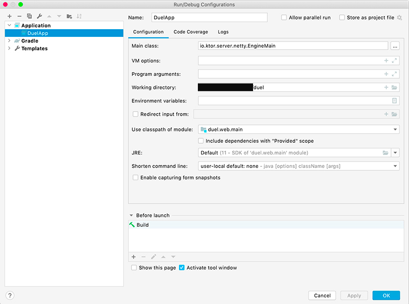

duel
===

Simulates a [duel](https://en.wikipedia.org/wiki/Duel) and streams live updates. Live: https://asarkar-duel.herokuapp.com/

### Technologies Used

1. [Ktor](https://ktor.io/): For server-side Websocket and session.
2. [Kodein-DI](https://github.com/Kodein-Framework/Kodein-DI): For KOtlin DEpendency INjection.
3. [grpc-kotlin](https://github.com/grpc/grpc-kotlin): For bidirectional gRPC streaming modelled as Kotlin `Flow`.
4. [Vue.js](https://vuejs.org/): For client UI.

### Running Locally

Run `./gradlew clean run` and go to the URL shown on the console once the application has started.

To run from inside IntelliJ, create a new Run Configuration as shown below:

### Deploying to Heroku

1. Commit all changes locally.
2. `heroku login`
3. `git push heroku master`
4. `heroku logs --tail`
5. `heroku open`